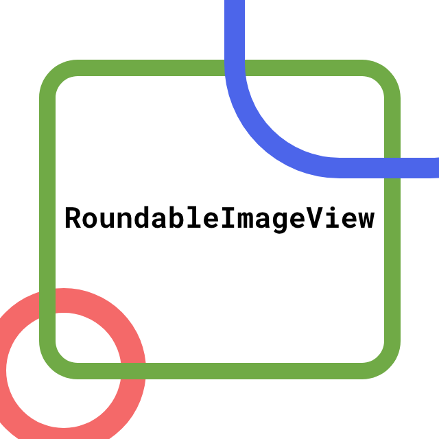
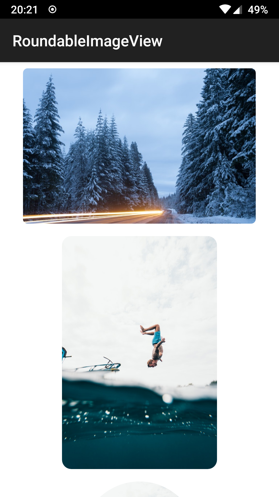
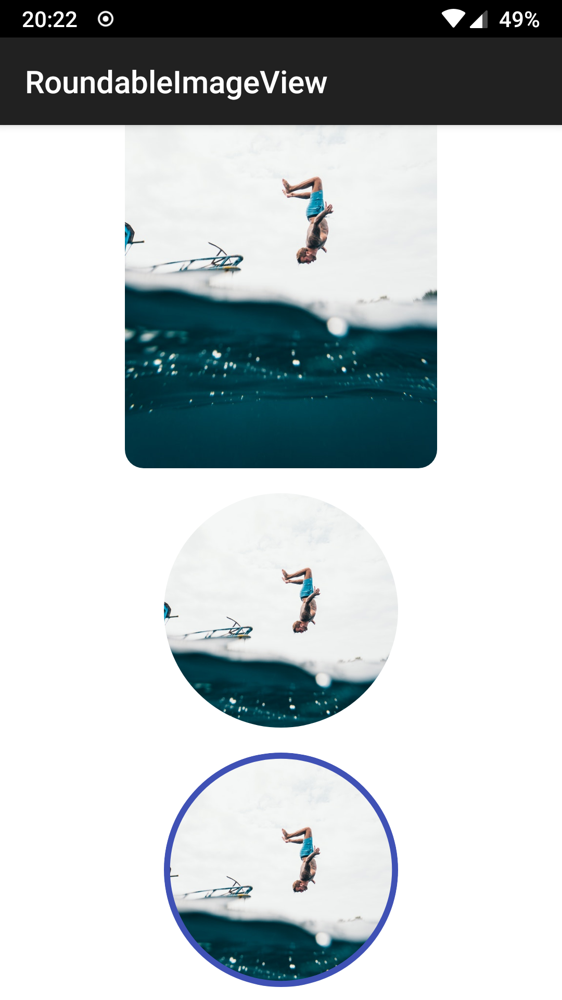

# RoundableImageView



<hr/>
Image view that could be rounded! (or even be a circle)
Works well with most image loading libraries.

# Usage

Use it like you would use simple image!

You can customize shape of displayed image with special attributes:
```xml
<attr name="cornerRadius_common" format="dimension"/>
<attr name="cornerRadius_top_left" format="dimension"/>
<attr name="cornerRadius_top_right" format="dimension"/>
<attr name="cornerRadius_bottom_right" format="dimension"/>
<attr name="cornerRadius_bottom_left" format="dimension"/>
<attr name="isCircle" format="boolean"/>
<attr name="borderColor" format="color"/>
<attr name="borderWidth" format="dimension"/>
```

```xml
<dev.warwas.RoundableImageView
            android:layout_width="wrap_content"
            android:layout_height="200dp"
            android:layout_margin="8dp"
            android:adjustViewBounds="true"
            android:src="@drawable/image"
            app:cornerRadius_common="6dp" />
```
Remember to set `adjustViewBounds` to `true` to get best results.

# Examples





# Installation

Add to your dependencies block:
```groovy
implementation 'dev.warwas.roundableimageview:roundableimageview:1.0.0'
```
